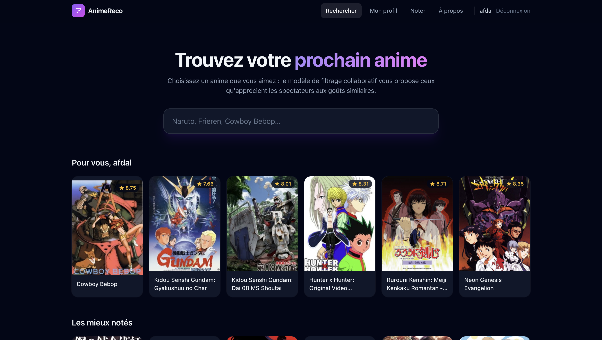

# Anime Recommendations

[](https://www.python.org/)


Welcome to the anime recommendations project! This project uses a collaborative filtering model to recommend animes based on user preferences.


## Screenshot



## Features

- Search for animes by name
- Recommend similar animes
- Rate animes (search any title) and get personal recommendations instantly
- Profile by pseudo: come back with the same pseudo to find your ratings and recommendations (no password)

## Architecture


## Installation

1. Clone the repository:
   ```bash
   git clone https://github.com/Afdal-B/anime-recommendations.git
   ```
2. Navigate to the project directory:
   ```bash
   cd anime-recommendations
   ```
3. Install server dependencies:
   ```bash
   pip install -r server/app/requirements.txt
   ```
4. Install front-end dependencies:
   ```bash
   cd client
   npm install
   ```

## Usage

### Quick local test (no Azure needed)

Runs the real app on a local SQLite database seeded from the CSV:

```bash
python3 -m venv .venv && .venv/bin/pip install -r server/app/requirements.txt
cd client && npm install && npm run build && cd ..
.venv/bin/python server/dev_server.py   # then open http://localhost:8000
```

### Against Azure SQL

1. Start the server (from `server/app`, with `AZURE_DATABASE_CONNECTION_STRING` set in `server/app/.env`):
   ```bash
   cd server/app
   uvicorn main:app --reload
   ```
2. Start the front-end (API calls to `/api` are proxied to `localhost:8000`):
   ```bash
   cd client
   npm start
   ```
3. Open `http://localhost:3000` for the user interface and `http://localhost:8000/docs` for the API.

## Model training

The ALS model is trained with PySpark (`server/ml/train_als.py`) and served with NumPy from its factor files, so the API needs no JVM.

- **Data**: `ratings.csv` (the MyAnimeList Kaggle dataset, first 30,000 users, built with `server/ml/prepare_ratings.py`) plus one small `new/*.csv` file per rating submission from the app. App users start at ID 10,000,000 so they never collide with dataset users.
- **Training**: an Azure ML pipeline (`server/ml/train-pipeline.yml`), run on demand with `./deploy/retrain.sh` on a cluster that scales to zero. A weekly schedule (`server/ml/schedule.yml`) is available but off by default, since new ratings are rare: enable it with `TRAINING_SCHEDULE=1 ./deploy/azure-deploy.sh`. Storage access uses the cluster's managed identity, with no keys.
- **Personal recommendations**: computed on the fly from the user's ratings (ALS "fold-in": item vectors stay fixed and the user vector is solved by non-negative least squares, like one ALS half-step). No retraining is needed; on dataset users it reproduces the Spark-trained vectors exactly. Only animes with at least `MIN_ITEM_RATINGS` (default 50) training ratings are recommended, as rarely rated animes have unreliable vectors (counts are saved with the model in `item_counts.csv`).
- **Serving**: each run writes `models/als_model/<run>/`, with a `_READY` marker written last. The API loads the newest complete model at startup and checks for a new one every hour (`MODEL_REFRESH_SECONDS`). It falls back to the model baked into the image.

Train locally (Java 17 required):

```bash
pip install -r server/ml/requirements.txt
python server/ml/train_als.py --ratings <folder with ratings.csv> --output <model folder>
```

## Deployment (Azure)

A single container serves both the API (`/api/...`) and the React build.

```bash
az login
SQL_ADMIN_PASSWORD='<strong-password>' ./deploy/azure-deploy.sh
./deploy/retrain.sh   # retrain the model when new ratings have come in
```

`azure-deploy.sh` creates:

| Service | Role |
| --- | --- |
| Azure SQL Database (serverless free offer) | Catalog, users, ratings. A job creates the schema (`server/schema.sql`) and loads the catalog. |
| Blob Storage | `data/` training ratings, `models/` model versions |
| Container Registry | Docker image, built in Azure (no local Docker needed) |
| Container Apps | The app, scaling to zero |
| Azure Machine Learning | Workspace, training cluster (0 to 1 node) |

On the first deployment, the initial ratings are read from `server/data/user-filtered.csv` (from the Kaggle dataset [`dbdmobile/myanimelist-dataset`](https://www.kaggle.com/datasets/dbdmobile/myanimelist-dataset), 1.5 GB, not versioned). Set `KAGGLE_RATINGS_CSV` to use another path.
